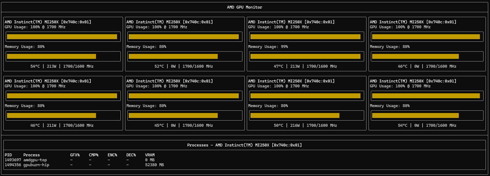

# amdgpu-top

`amdgpu-top` is a tool for monitoring AMD GPU usage. It is written in C++ using C++17 standards and utilizes the FTXUI library for its user interface. Data parsing is handled through `libamdgpu_drm.so`.



## Features

- Real-time monitoring of AMD GPU usage
- User-friendly interface built with FTXUI

## Requirements

- C++17 compatible compiler
- FTXUI library (build from source)
- `libamdgpu_drm.so`

## Supported Devices
- AMD Radeon dGPU (RX7900XT...)
- AMD Radeon iGPU (Radeon 780M...)
- AMD Instinct GPU PCIE/XGMI (MI210, MI250...)

## Build from Source

### Build FTXUI

To build the FTXUI library, follow these steps:

```bash
git clone https://github.com/ArthurSonzogni/FTXUI.git
cd FTXUI
mkdir -p build && cd build
cmake .. && make -j $(nproc)
sudo make install
```
### Build amdgpu-top
To build `amdgpu-top`, follow these steps:
```bash
git clone https://github.com/KerwinTsaiii/amdgpu-top.git
git submodule update --init --recursive
mkdir build
cd build
cmake -DCMAKE_BUILD_TYPE=Release ..
make
```
#### Debug Build
```bash
mkdir build && cd build
cmake -DCMAKE_BUILD_TYPE=Debug ..
make
```
In debug mode, logs will be stored in `/tmp/amdgpu-top.log`.

## Usage
To run `amdgpu-top`, execute the following command:
```bash
./amdgpu-top
```

## Contributing
Contributions are welcome! Please fork the repository and submit a pull request.

## Acknowledgements
- FTXUI for the UI framework
- The developers of libamdgpu_drm.so for data parsing support

Feel free to modify this as needed! If you have any specific sections you'd like to add or change, let me know.
